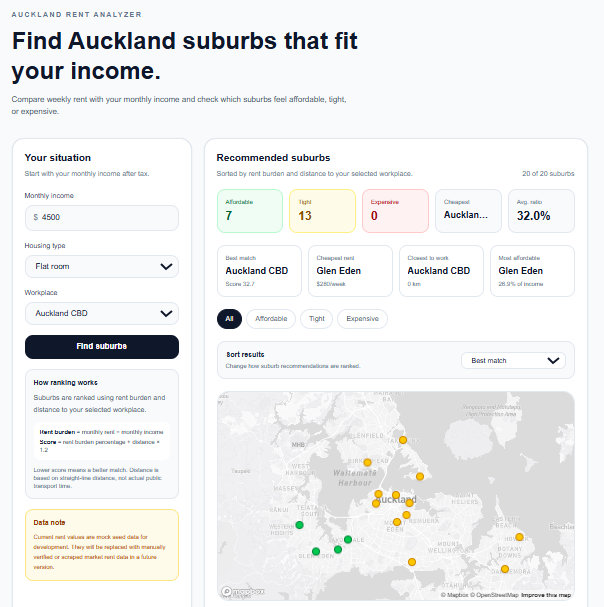
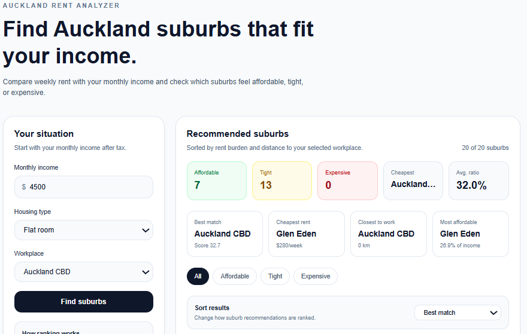
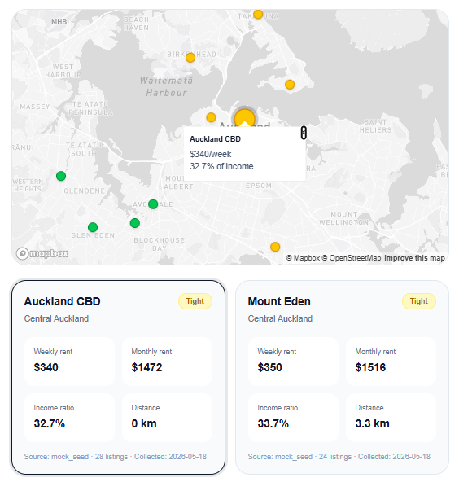
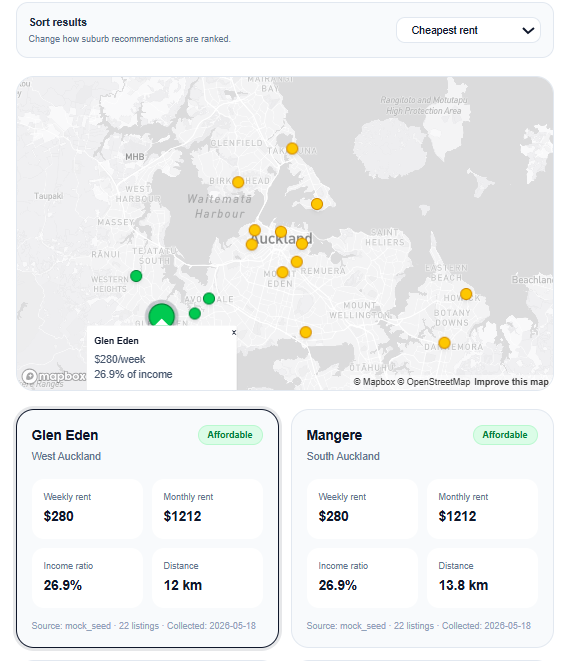

# 🏠 Auckland Rent Analyzer



**Auckland Rent Analyzer** is a data-driven web application that helps users compare Auckland suburbs based on their monthly income, housing type, and workplace location.

The application calculates rent affordability, visualizes suburb recommendations on an interactive map, and helps users understand which areas may be affordable, tight, or expensive based on their personal situation.

<br/>
<br/>

# ✨ Main Features

### 1. 💸 Rent Affordability Analysis

* **Income-Based Rent Calculation:** Users enter their monthly income to calculate how much of their income would be spent on rent in each Auckland suburb.
* **Rent-to-Income Ratio:** The app converts weekly rent into monthly rent and calculates the rent burden percentage.
* **Affordability Status:** Each suburb is classified into three levels:

  * Affordable
  * Tight
  * Expensive

<br/>

### 2. 🏘️ Housing Type Comparison

* **Flexible Housing Options:** Users can compare different housing types based on their living situation.
* **Supported Housing Types:**

  * Flat room
  * 1 Bedroom
  * 2 Bedrooms
  * 3 Bedrooms
* **Dynamic Results:** Rent affordability results update based on the selected housing type.

<br/>

### 3. 📍 Workplace-Based Recommendation

* **Workplace Selection:** Users can select their workplace location in Auckland.
* **Distance-Based Ranking:** The app calculates the straight-line distance between each suburb and the selected workplace.
* **Recommendation Score:** Suburbs are ranked using both rent burden and distance to work.

```txt
Recommendation Score = Rent Burden Percentage + Distance to Workplace × 1.2
```

<br/>

### 4. 🗺️ Interactive Map Visualization

* **Mapbox Integration:** Suburb recommendations are displayed on an interactive Mapbox map.
* **Color-Coded Markers:**

  * 🟢 Affordable
  * 🟡 Tight
  * 🔴 Expensive
* **Card & Map Interaction:**

  * Hovering over a result card highlights the matching map marker.
  * Clicking a map marker highlights and scrolls to the matching suburb card.

<br/>

### 5. 📊 Result Filtering & Sorting

* **Status Filter:** Users can filter suburbs by affordability status:

  * All
  * Affordable
  * Tight
  * Expensive
* **Sorting Options:**

  * Best match
  * Cheapest rent
  * Closest to work
  * Lowest income ratio

<br/>

### 6. ⚡ Quick Insights

* **Summary Cards:** The app provides quick overview metrics such as:

  * Number of affordable suburbs
  * Number of tight suburbs
  * Number of expensive suburbs
  * Cheapest suburb
  * Average rent-to-income ratio
* **Quick Insight Cards:** Users can instantly identify:

  * Best match
  * Cheapest rent
  * Closest suburb to work
  * Most affordable suburb

<br/>
<br/>

# 🧠 Why I Built This

Finding a place to live in Auckland is difficult because rent affordability depends on multiple factors such as income, housing type, workplace location, and transport distance.

This project was built to solve a real-life problem:
**“With my income, which Auckland suburb can I realistically afford?”**

Instead of simply listing rental prices, the app combines rent data, income-based affordability, workplace distance, and interactive visualization to support practical decision-making.

<br/>
<br/>

# 🧮 How the Ranking Works

The application uses a simple MVP-level scoring algorithm.

### 1. Monthly Rent Calculation

```txt
Monthly Rent = Weekly Rent × 4.33
```

### 2. Rent Burden Calculation

```txt
Rent Burden Percentage = Monthly Rent ÷ Monthly Income × 100
```

### 3. Recommendation Score

```txt
Recommendation Score = Rent Burden Percentage + Distance to Workplace × 1.2
```

A lower score means the suburb is a better match.

<br/>

> Note: Distance is currently calculated using straight-line distance based on latitude and longitude. It does not yet reflect real public transport time, traffic, or route availability.

<br/>
<br/>

# 🗂️ Data

### Current Data

The current version uses mock seed data for development and UI testing.

Rent values were estimated based on Auckland-wide rental market references and relative suburb pricing patterns. They are not official suburb-level statistics.

### Planned Data Improvement

Future versions will replace mock seed data with manually verified or scraped listing-based market rent data.

Possible data sources include:

* MBIE / Tenancy Services rental bond data
* Trade Me rental listings
* Auckland suburb coordinate data
* Auckland Council / Stats NZ geographic data

<br/>
<br/>

# 🖥️ Main Screens







<br/>
<br/>

# ⚙️ System Architecture


```txt
User Input
  ↓
Next.js Frontend
  ↓
Next.js API Routes
  ↓
Supabase PostgreSQL
  ↓
Affordability Calculation
  ↓
Mapbox Map + Result Cards
```

<br/>
<br/>

# 🧩 Project Structure

```txt
auckland-rent-analyzer/
├── app/
│   ├── page.tsx
│   └── api/
│       ├── suburbs/route.ts
│       ├── rents/route.ts
│       └── affordability/route.ts
├── components/
│   └── RentMap.tsx
├── data/
│   ├── suburbs.csv
│   └── rent_snapshots.csv
├── lib/
│   └── supabase.ts
├── public/
│   └── readme/
└── README.md
```

<br/>
<br/>

# 🛠️ Tech Stack

## Programming Language


<br/>

## Frontend

  

<br/>

## Backend & API


<br/>

## Database

 

<br/>

## Map


<br/>

## Deployment
<a href = "https://auckland-rent-analyzer-xedi.vercel.app/">


<br/>

## Source Code Management


<br/>
<br/>

# 🚀 Getting Started

## 1. Clone the Repository

```bash
git clone https://github.com/your-username/auckland-rent-analyzer.git
cd auckland-rent-analyzer
```

## 2. Install Dependencies

```bash
npm install
```

## 3. Set Environment Variables

Create a `.env.local` file in the project root.

```env
NEXT_PUBLIC_SUPABASE_URL=
NEXT_PUBLIC_SUPABASE_ANON_KEY=
NEXT_PUBLIC_MAPBOX_TOKEN=
```

## 4. Run the Development Server

```bash
npm run dev
```

Open the app in your browser:

```txt
http://localhost:3000
```

<br/>
<br/>

# 🗄️ Database Schema

## suburbs

```sql
create table suburbs (
  id bigserial primary key,
  name text not null,
  slug text not null unique,
  latitude numeric not null,
  longitude numeric not null,
  area text not null,
  created_at timestamp with time zone default now()
);
```

## rent_snapshots

```sql
create table rent_snapshots (
  id bigserial primary key,
  suburb_slug text not null references suburbs(slug) on delete cascade,
  rental_type text not null,
  bedrooms int not null,
  median_weekly_rent int not null,
  listing_count int not null,
  source text not null,
  collected_at date not null,
  created_at timestamp with time zone default now()
);
```

<br/>
<br/>

# 📌 Current Limitations

* Current rent values are mock seed data.
* Distance is calculated using straight-line distance, not actual commute time.
* Public transport cost and travel duration are not included yet.
* The app currently focuses on selected Auckland suburbs only.
* Real-time rental listing updates are not yet implemented.

<br/>
<br/>

# 🔮 Future Improvements

* Replace mock rent values with verified Trade Me or Tenancy Services based data.
* Add automated rental data collection pipeline.
* Add real commute time using Mapbox Directions API or another routing API.
* Add public transport cost estimation.
* Add suburb detail pages.
* Add rent trend charts.
* Add roommate / shared rent calculator.
* Expand suburb coverage across the Auckland region.

<br/>
<br/>


<br/>
<br/>

# 🌐 Deployment

<a href = "https://auckland-rent-analyzer-xedi.vercel.app/">

</a>

<br/>
<br/>

# 👩‍💻 Developer

|  |
| ------------------------------------------------------------------------------------------ |
| [Seyoung Oh](https://github.com/osy0602)                                             |

<br/>
<br/>

# 📄 License

This project is built for personal portfolio and learning purposes.
